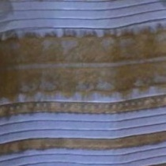
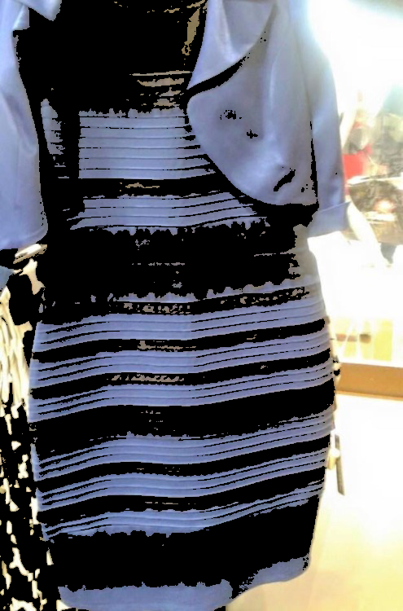

#NAME
whitegoldblueandblack - tools to explore the great #whiteandgold #blueandblack mystery that erupted on the Internet in late February 2015.

#SYNOPSIS
	wgbb {option...} < image > image.png

	where option is one or more of:
		[--jpeg]
		[--sort-by-brightness]
		[--randomize [--stride=n]]
		[--colorize [--min-percentile=0] [--max-percentile=50] [--colorize-prob=1.0]]

	stdin is a PNG or (--jpeg: JPEG) image. stdout is a PNG image.

#OPTIONS

##--jpeg

The input is a JPEG image, otherwise the input is a PNG image.

##--sort-by-brightness

The pixels of the image are sorted in brightness order - darkest to top-left, brightest to bottom-right

##--randomize

Columns and rows of {stride} pixel width of the input image are randomly permuted.

##--colorize

Pixels within the specified percentiles (--min-percentile, --max-percentile) of brigthness are replaced with the specified color (--color) with a specified probability (--colorize-prob)

#BUILDING

Install go,
	make

#EXAMPLES

Here is the original image:

Here is the same image randomized with:

	wgbb --jpeg --randomize --stride=1 < input/original.jpeg > output/random.png

Here is the same image sorted by brightness:

	wgbb --jpeg --sort-by-brightness < input/original.jpeg > output/brightness.png

Here is a sort by brightness analysis and randomization done to a small snippet of the dress:

	wgbb --jpeg --sort-by-brightness < input/snippet.jpeg > output/snippet-brightness.png
	wgbb --jpeg --randomize< input/snippet.jpeg > output/snippet-random.png

  

Here is the same sort by brightness analysis done to a snippet of the gold (or black) region near the neckline:

	wgbb --jpeg --sort-by-brightness < input/gold-snippet.jpeg > output/gold-snippet.png

 
 

Here is the same sort by brightness analysis done to a small snippet of the 'white (or blue)' region on the subject's left shoulder:

	wgbb --jpeg --sort-by-brightness < input/white-snippet.jpeg > output/white-snippet.png

 
 

Here is what happens when the darkest 40% of pixels are replaced with black.

	wgbb --jpeg --colorize --min-percentile 0 --max-percentile 40 --color "#000000" --colorize-prob 1.0 < input/original.jpg  > output/blacken.png

