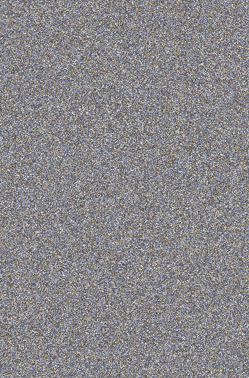
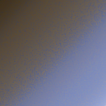
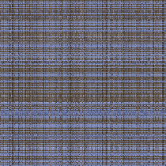

#NAME
whitegoldblueandblack - tools to explore the great #whiteandgold #blueandblack mystery that erupted on the Internet in late February 2015.

#SYNOPSIS
	wgbb {option...} < image > image.png

	where option is one or more of:
		[--jpeg]
		[--color {hex-color}]
		[--ref-color {hex-color}]
		[--width {pixels}]
		[--height {pixels}]
		[--sort-by-distance]
		[--randomize [--stride=n]]
		[--randimize-blocks]
		[--mix-blocks]
		[--colorize [--min-percentile=n] [--max-percentile=n] [--colorize-prob=p]]
		[--rgb]
		[--lab]

	stdin is a PNG or (--jpeg: JPEG) image. stdout is a PNG image.

#OPTIONS

##--jpeg

The input is a JPEG image, otherwise the input is a PNG image.

##--color

The color to be used for colorizing. Defaults to #000000

##--ref-color

The color to be used as the reference color for distance calculations during (--sort-by-distance) or colorization (--colorize). Defaults to #000000.

##--sort-by-distance

The pixels of the image are sorted in color space distance order - pixels closest to the reference color are sorted top-left, pixels furthest from the reference color are sorted bottom-right.

##--randomize

Columns and rows of {stride} pixel width of the input image are randomly permuted. If two blocks are in the same row or column in the input image, they will be also be in the same row and column of the output image, however the row and colum may be different and the distance between the blocks may also be different.

##--randomize-blocks

Randomly swaps blocks of the input image to form the output image. Unlike --randomize, the row and column neighbours of an input block are not preserved in the output image. The size of the moved blocks are specified by --width and --height.

##--mix-blocks

Randomly mixes the pixels within blocks of the size specified by --width and --height.

##--colorize

Pixels within the specified percentiles (--min-percentile, --max-percentile) of distance are replaced with the specified color (--color) with a specified probability (--colorize-prob).

##--rgb

Perform distance calculations in the RGB color space. This is the default option.

##--lab

Perform distance calculations in the [CIE-Lab](http://en.wikipedia.org/wiki/Lab_color_space) color space.

#BUILDING

Install go,
	make

#EXAMPLES

Here is the original image:

Here is the same image randomized with various stride sizes:

	wgbb --jpeg --randomize-blocks --width=1 --height=1 < input/original.jpeg > output/random.png
	wgbb --jpeg --randomize-blocks --width=16 --height=16 < input/original.jpeg > output/random-16.png
	wgbb --jpeg --randomize-blocks --width=32 --height=32 < input/original.jpeg > output/random-32.png

Here is the image mixed in 16x16 and 3x495 blocks:

 

Here is the same image sorted by distance in the RGB and Lab color spaces:

	wgbb --jpeg --sort-by-distance < input/original.jpeg > output/distance-rgb.png
	wgbb --jpeg --sort-by-distance --lab < input/original.jpeg > output/distance-lab.png

 

Here is a sort by distance analysis and randomization done to a small snippet of the dress:

	wgbb --jpeg --sort-by-distance < input/snippet.jpeg > output/snippet-distance.png
	wgbb --jpeg --randomize < input/snippet.jpeg > output/snippet-random.png
	wgbb --jpeg --randomize-blocks < input/snippet.jpeg > output/snippet-randomize-blocks.png
	wgbb --jpeg --mix-blocks --height 3 --width 210 < input/snippet.jpeg > output/snippet-mix.png

    

Here is the same sort by distance analysis done to a snippet of the gold (or black) region near the neckline:

	wgbb --jpeg --sort-by-distance < input/gold-snippet.jpeg > output/gold-snippet.png

 
 

Here is the same sort by distance analysis done to a small snippet of the 'white (or blue)' region on the subject's left shoulder:

	wgbb --jpeg --sort-by-distance < input/white-snippet.jpeg > output/white-snippet.png

 
 

Here is what happens when the darkest 40% of pixels are replaced with black.

	wgbb --jpeg --colorize --min-percentile 0 --max-percentile 40 --color "#000000" --colorize-prob 1.0 < input/original.jpg  > output/blacken.png

#REVISIONS

* 0.1.0 - development release